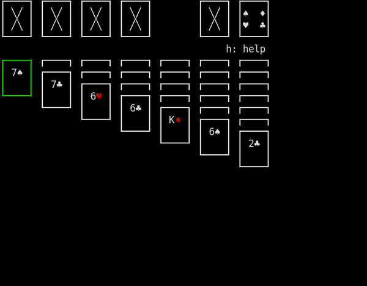

# Solitaire
A simple terminal-based solitaire game written in C using Ncurses

## Dependencies
Requires an installation of ncursesw as unicode is used extensively, and ncurses is used for display.

## Building
You can build using the makefile provided.

## Running
You can play the game by running the `solitaire` executable created by the makefile.

## Controls
w:      up

a:      left

s:      down

d:      right

f:      flip

space:  select

c:      cancel

q:      quit

## Visual Indicators
Yellow border on card:  card selected

Green border on card:   current cursor position

Big X on card:          empty spot

4 symbols on card:      card present but not visible

